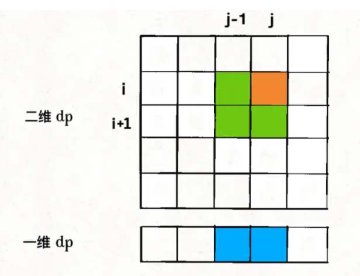
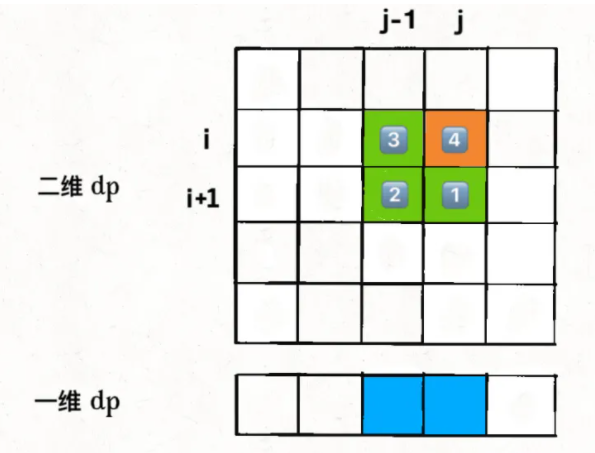
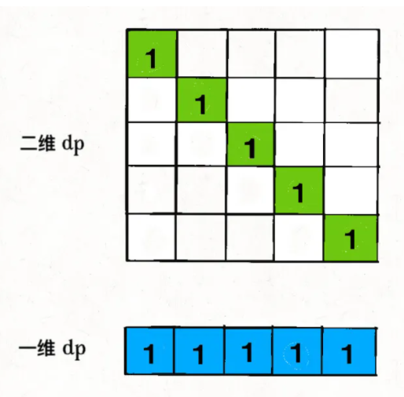

# 动态规划

  # 1. 基本内容

## 1.1 动态规划解题套路框架

[动态规划系列/动态规划详解](https://github.com/labuladong/fucking-algorithm/blob/master/%E5%8A%A8%E6%80%81%E8%A7%84%E5%88%92%E7%B3%BB%E5%88%97/%E5%8A%A8%E6%80%81%E8%A7%84%E5%88%92%E8%AF%A6%E8%A7%A3%E8%BF%9B%E9%98%B6.md)

- 动态规划的一般形式
  - 求最值

- 动态规划问题的特征
  - 重叠子问题
    - 问题可以拆解为形式相同，规模更小的子问题
  - 最优子结构
    - 可以通过子问题的最优解推出原问题的最优解

- 动态规划的核心
  - 穷举

- 动态规划解法的要点
  - base case
  - 明确[状态]
    - 状态即原问题和子问题中会变化的变量
  - 明确[选择]
    - 选择即导致“状态”产生变化的行为
  - 定义dp数组/函数的含义

```java
// initialize base case 
dp[0][0][...] = base 
// status transaction
for status1 in each_value_of_status1 {
  for status2 in each_value_of_status2 {
    for ... {
      dp[status1][status2][...] = extremum(option1, option2...);
    }
  }
}
```

- 自顶向下: given f(n) -> calculate f(0)
  - recursion
- 自底向上: given f(0) -> calculate f(n)
  - iterate

[leetcode 509](https://leetcode-cn.com/problems/fibonacci-number)
[leetcode 322](https://leetcode-cn.com/problems/coin-change)


## 1.2 最优子结构详解

[动态规划系列/最优子结构](https://github.com/labuladong/fucking-algorithm/blob/master/%E5%8A%A8%E6%80%81%E8%A7%84%E5%88%92%E7%B3%BB%E5%88%97/%E6%9C%80%E4%BC%98%E5%AD%90%E7%BB%93%E6%9E%84.md)

最优子结构是某类问题的特定性质，并不是动态规划独有的，即很多问题都有最优子结构，只是大部分不具有重叠子问题，因此不会被归类为动态规划问题而已。

如果遇到最优子结构失效的情况——**改造问题**

相关问题：高楼扔鸡蛋

## 1.3 状态压缩

[动态规划系列/状态压缩](https://mp.weixin.qq.com/s?__biz=MzAxODQxMDM0Mw==&mid=2247485824&idx=1&sn=09caa56172729cf8cf1b53089e8dee55&chksm=9bd7f788aca07e9e4149f384ec5e279adadec75a2828a76066c56b4789209fb1cd54f9e63f9d&scene=21#wechat_redirect)

能够使用状态压缩的动态规划都是二维dp问题：

如果计算状态dp[i][j]需要的都是dp[i][j]相邻的状态，就可以使用状态压缩

例如最长回文子序列中：

```java
int longestPalindromeSubseq(string s) {
  int n = s.size();
  // dp 数组全部初始化为 0 
  vector<vector<int>> dp(n, vector<int>(n, 0));
  // base case
  for (int i = 0; i < n; i++)
    dp[i][i] = 1;
  // 反着遍历保证正确的状态转移
  for (int i = n - 2; i >= 0; i--) {
    for (int j = i + 1; j < n; j++) {
      // 状态转移方程
      if (s[i] == s[j]) dp[i][j] = dp[i + 1][j - 1] + 2;
      else dp[i][j] = max(dp[i + 1][j], dp[i][j - 1]);
    }
  }
  // 整个 s 的最长回文子串长度
  return dp[0][n - 1];
}
```

可以看到，dp[i][j]的更新只依赖于`dp[i + 1][j - 1]`, `dp[i][j - 1]`, `dp[i + 1][j]`这三个状态

状态压缩的核心思路：**将二维数组投影到一维数组**



但有一个明显的问题，图中dp[i][j - 1]和dp[i + 1][j - 1]两个状态位于同一列，在一维数组中会重叠

将二维数组压缩成一维，一般来说是将第一个维度也就是i去掉，压缩后的dp数组就是二维数组的dp[i][...]这一行

对于代码：

```java
for (int i = n - 2; i >= 0; i--) {
  for (int j = i + 1; j < n; j++) {
    if (s[i] == s[j]) dp[i][j] = dp[i + 1][j - 1] + 2;
    else dp[i][j] = max(dp[i + 1][j], dp[i][j - 1]);
  }
}
```

我们首先无脑去掉i维度：

```java
for (int i = n - 2; i >= 0; i--) {
  for (int j = i + 1; j < n; j++) {
    // 这里dp[j]代表着什么？
    if (s[i] == s[j]) dp[j] = dp[j - 1] + 2;
    else dp[j] = max(dp[j], dp[j - 1]);
  }
}
```

我们要思考两个问题：

1. dp[j]对应二维dp中的什么位置?
- 在对dp[j]赋新值之前，就是外层for循环上一次迭代出来的值，即二维dp中`dp[i + 1][j]`
2. dp[j - 1]对应二维dp中的什么位置？
- dp[j - 1]就是内层for循环上一次迭代出来的值，即二维dp中的`dp[i][j - 1]`

这两个答案是如何得到的？——仅仅通过上下代码的对比即可得知

```
dp[i][j] =  max(dp[i + 1][j], dp[i][j - 1]);
                  +               +
                  |               |
dp[j] =     max(dp[j],        dp[j - 1]);
```


由此，我们需要的状态只剩下`dp[i + 1][j - 1]`没有得到。

```java
for (int i = n - 2; i >= 0; i--) {
  for (int j = i + 1; j < n; j++) {
    // dp[i][j] = dp[i + 1][j - 1] + 2
    if (s[i] == s[j]) dp[j] = ?? + 2;
    // dp[i][j] = max(dp[i + 1][j], dp[i][j - 1])
    else dp[j] = max(dp[j], dp[j - 1]);
  }
}
```

因为for遍历i和j的顺序为从左到右，从下向上，因此在更新一维dp数组时，`dp[i + 1][j - 1]`会被`dp[i][j - 1]`覆盖掉：



因此需要在被覆盖之前使用临时变量保存

```java
for (int i = n - 2; i >= 0; i--) {
  // pre存储dp[i + 1][j - 1]
  int pre = 0;
  for (int j = i + 1; i < n; j++) {
    // 当前迭代中的dp[i][j - 1]就是下一轮迭代中的dp[i + 1][j - 1]
    int tmp = dp[j];
    if (s[i] == s[j]) dp[j] = pre + 2;
    else dp[j] = max(dp[j], dp[j - 1]);
    pre = tmp;
  }
}
```

还需要将base case进行投影：

```java
// base case 
for (int i = 0; i < n; i++) {
  dp[i][j] = 1;
}
```



可以看到不存在覆盖冲突，因此可以直接投影：

```java
int[] dp = new int[n];
Arrays.fill(dp, 1);
```

完整代码如下：

```java
int longestPalindromeSubseq(string s) {
  int n = s.size();
  // base case：一维 dp 数组全部初始化为 1
  vector<int> dp(n, 1);
  for (int i = n - 2; i >= 0; i--) {
    int pre = 0;
    for (int j = i + 1; j < n; j++) {
      int temp = dp[j];
      // 状态转移方程
      if (s[i] == s[j])
        dp[j] = pre + 2;
      else
        dp[j] = max(dp[j], dp[j - 1]);
      pre = temp;
    }
  }
  return dp[n - 1];
}
```
[滚动数组](./scrollingArray/README.md)

## 1.4 动态规划和回溯算法

[leetcode 494](https://leetcode-cn.com/problems/target-sum/)

1. 回溯法

[Backtrack.java](./targetSum/Backtrack.java)
[Backtrack01.java](./targetSum/Backtrack01.java)

2. Memo

[Memo.java](./targetSum/Memo.java)

3. Dynamic

[Dynamic.java](./targetSum/Dynamic.java)

# 2. 子序列类型问题

## 2.1 编辑距离

如何一眼看出重叠子问题的存在？

抽象出算法的递归框架：

```
def dp(i, j):
  dp(i - 1, i - 1)  # 1
  dp(i, j - 1)      # 2
  dp(i - 1, j)      # 3
```

对于子问题`dp(i - 1, j - 1)`，如何通过原问题`dp(i, j)`得到？

显然有不止一条路径，例如`dp(i, j) -> #1`和`dp(i, j) -> #2 -> #3`

如果存在一条重复路径，就说明算法存在大量重复路径，即重叠子问题

1. [recursion](./editDistance/Naive.java)

2. [dynamic](./editDistance/Dynamic.java)

3. [compress](./editDistance/Compress.java)

## 2.2 信封嵌套问题

偏序问题

## 2.3 最大子数组

## 2.4 最长公共子序列

## 2.5 子序列问题解题模板 

# 3. 背包问题

## 3.1 0-1背包问题

给你一个可装载重量为 W 的背包和 N 个物品，每个物品有重量和价值两个属性。其中第 i 个物品的重量为 `wt[i]`，价值为 `val[i]`，现在让你用这个背包装物品，最多能装的价值是多少？

例如：N = 3, W = 4, wt = [2, 1, 3], val = [4, 2, 3], result = 4 + 2 = 6

所谓的0-1：物品不可分割，要么装进包里(1)，要么不装进包里(0)

1. status: knapsack's capacity and optional things

so we need a two-demon DP table

2. option: each thing can be packed or not packed

3. definition of DP table:

dp[i][w] -> for the first i thing, current capacity is w, the max value is dp[i][w]

the result is dp[N][W]

base case: dp[0][..] = dp[..][0] = 0

4. status transmission

the option for each thing is just pack or not pack

so:

```
if not pack A[i]:
  dp[i][w] = dp[i - 1][w]
if pack A[i]:
  dp[i][w] = dp[i - 1][w - wt[i - 1]] + val[i - 1]
```

## 3.2 子集背包问题

转化为01背包问题

```java
public boolean canPartition(int[] nums) {
  int W = 0;
  for (int i : nums) {
    W += i;
  }
  if ((W & 1) == 1) return false;
  W /= 2;
  int N = nums.length;
  boolean[][] dp = new boolean[N + 1][W + 1];
  for (int i = 1; i <= N; i++) dp[i][0] = true;
  for (int i = 1; i <= N; i++) {
    for (int w = 1; w <= W; w++) {
      if (w - nums[i - 1] < 0) {
        dp[i][w] = dp[i - 1][w];
      } else {
        dp[i][w] = dp[i - 1][w] || dp[i - 1][w - nums[i - 1]];
      }
    }
  }
  return dp[N][W];
}
```

状态压缩：

`dp[i][w]`都是由`dp[i - 1][...]`转移过来的，因此可以进行状态压缩

```java
boolean[] dp = new boolean[W + 1];
for (int i = 1; i <= N; i++) {
  dp[0] = true;
  for (int w = 1; w <= W; w++) {
    if (w - nums[i - 1] < 0) {
      dp[w] = dp[w];
    } else {
      dp[w] = dp[w] || dp[w - nums[i - 1]];
    }
  }
}
```
注意：如果w从小到大，则dp[w - nums[i - 1]]会在dp[w]被计算之后才计算

因此w需要从大到小计算

```java
boolean[] dp = new boolean[W + 1];
dp[0] = true;
for (int i = 1; i <= N; i++) {
  for (int w = W; w > 0; w--) {
    if (w - nums[i - 1] < 0) {
      dp[w] = dp[w];
    } else {
      dp[w] = dp[w] || dp[w - nums[i - 1]];
    }
  }
}
```

整理后：

```java
boolean[] dp = new boolean[W + 1];
dp[0] = true;
for (int i = 1; i <= N; i++) {
  for (int w = W; w > 0; w--) {
    if (w - nums[i - 1] >= 0) {
      dp[w] = dp[w] || dp[w - nums[i - 1]];
    }
  }
}
```

## 3.3 完全背包问题

[leetcode 518](https://leetcode-cn.com/problems/coin-change-2/)

