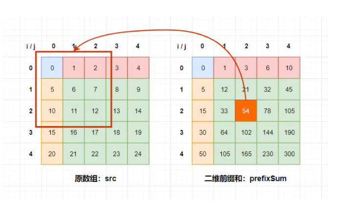

# 前缀和

[OI Wiki](https://oi-wiki.org/basic/prefix-sum/)
[csdn](https://blog.csdn.net/qq_41661809/article/details/86727017)
[zhihu](https://zhuanlan.zhihu.com/p/107778275)

## 1. 基本内容

前缀和是一种预处理技术，能够大大降低查询数组**区间和**的时间复杂度

可以简单理解为”数列的前n项的和“

简单来说，我们有一个数组x和它的前缀和数组y，满足以下公式：

```
y[0] = x[0]
y[1] = x[0] + x[1]
y[2] = x[0] + x[1] + x[2]
...
y[n] = x[1] + x[2] + ... + x[n]

```

则数组y就是数组x的前缀和，而且存在如下关系:

```
// for array x:
sum(left, right) = y[right] - y[left - 1]
```


1. 一维前缀和

一维前缀和的计算很简单，只需要遍历的时候一直把之前计算的和加上自己就能得到前缀和

```java
private int[] oneDimen(int[] src) {
  int[] res = new int[src.length];
  for (int i = 0; i < res.length; i++){
    if (i == 0) res[i] = src[i];
    else res[i] = res[i - 1] + src[i];
  }
  return res;
}
```
2. 二维前缀和

二维前缀和数组里每一个位置都表示原数组当前index左上方数字之和



计算方法：

```java
public int[][] towDimen(int[][] src){
  for (int i = 0; i < src.length; i++) {
    for (int j = 0; j < src.length; j++) {
      if (i == 0 && j == 0) {
        prefix[i][j] = src[i][j];
      } else if (i == 0) {
        prefix[i][j] = prefix[i][j - 1] + src[i][j];
      } else if (j == 0) {
        prefix[i][j] = prefix[i - 1][j] + src[i][j];
      } else {
        prefix[i][j] = prefix[i - 1][j] + prefix[i][j - 1] + src[i][j] - prefix[i - 1][j - 1];
      }
    }
  }
}
```

## 2. 应用

[leetcode 303](https://leetcode-cn.com/problems/range-sum-query-immutable/)
[leetcode 560](https://leetcode-cn.com/problems/subarray-sum-equals-k/)


# 差分

[zhihu](https://zhuanlan.zhihu.com/p/129256730)

## 1. 基本内容

前缀和可以在O(n)时间内预处理，在O(1)时间内查询任意区间和

差分可以看作是前缀和的逆运算，可以在O(1)时间内操作任意区间

差分其实就是下一个数值减去上一个数值

对于数组x，定义数组y：

```
y[i] = x[i] - x[i - 1]
```

```java
private int[] oneDimen(int[] src) {
  int[] res = new int[src.length + 1];
  res[0] = src[0];
  for (int i = 1; i < src.length; i++) {
    res[i] = src[i] - src[i - 1];
  }
}
```

要想通过差分数组快速进行区间增减的操作：

```java
// 要让src[i..j]的元素全部加三：
diff[i] += 3;
// TODO 有时候+1有时候不+1... confused
diff[j + 1] -= 3;
```

根据差分数组反推出原始数组：

```java
int[] res = new int[diff.length];
res[0] = diff[0];
for (int i = 1; i < diff.length; i++) {
  res[i] = diff[i] + res[i - 1];
}
```

## 2. 示例

[leetcode 1094](https://leetcode-cn.com/problems/car-pooling/)
[leetcode 1109](https://leetcode-cn.com/problems/corporate-flight-bookings/)


